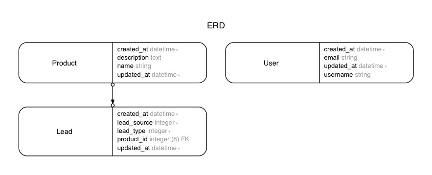

# Form object app

In this repo, I will practice implementing forms using `ActiveModel::Model`.

---

## Dependencies
- Ruby 2.3.1
- Rails 5.1.0.rc1
- Turbolinks
- Bootstrap 4
- and much more

---

## Database structure

